<h1 align="center">Hello World, I'm Abhijith P 👋</h1>

  

---

&nbsp;

---

### 👨🏻‍💻 &nbsp;About Me

💡 &nbsp;Flutter Developer with **2+ years** of experience building production-grade cross-platform apps for iOS and Android.

🚀 &nbsp;Currently at **Alice Blue Financial Services** — building fintech apps serving **50,000+ users.**\
🔒 &nbsp;Specialized in **SSL pinning**, biometric auth, clean architecture, and secure REST API integration.\
🌱 &nbsp;Always learning — currently exploring advanced Flutter animations and modern mobile patterns.\
✍️ &nbsp;Apart from coding, I enjoy design, content creation, and sharing my journey publicly.\
💬 &nbsp;Feel free to reach out for collaborations, consulting, or just a good tech chat!

---

### 📫 &nbsp;How to reach me

&nbsp;
&nbsp;
&nbsp;

---

### 🚀 &nbsp;Deployed Apps on Play Store

| App | Description | Tech Stack |
|-----|-------------|------------|
| Rise Pro | Mutual Fund · IPO · NFO platform | Flutter · BLoC · FCM · CleverTap · DevRev |
| Alice Blue eKYC | Digital KYC for demat account opening | Flutter · Provider · Hyperverge · Digio |
| AB Pulse | Trading signals & subscription platform | Flutter · Provider · CleverTap · Payment Gateway |
| AliceBlue PFM | Personal finance & mutual fund tracker | Flutter · Provider · Setu One Money · Digio |
| Advisory App | Partner referral & client management | Flutter · Riverpod · InAppWebView · DigiLink |

---

### 🛠 &nbsp;Languages and Tools

  <code></code>
  <code></code>
  <code></code>
  <code></code>
  <code></code>
  <code></code>
  <code></code>
  <code></code>
  <code></code>
  <code></code>
  <code></code>
  <code></code>

---

### 📊 &nbsp;Github Stats

  

---

  

